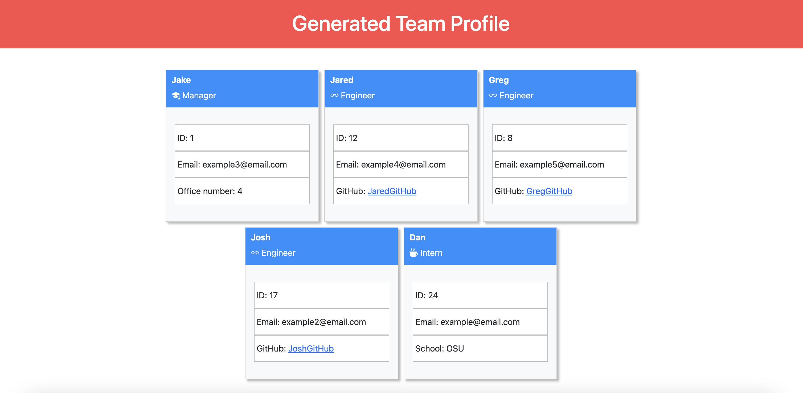

# Team Profile Generator

## Table of Contents
- [Description](#description)
- [Installation](#installation)
- [Usage](#usage)
- [Testing](#testing)
- [Questions](#questions)

## Description
This application was created to help users quickly build a landing page with cards containing basic information for each of their employees. 

Brief information includes: 
- Name
- Role
- Employee ID
- Email Address

And depending on the employee's role it may also include:
- Intern's school
- Engineer's Github
- Manager's office number
  
## Installation
1. Choose a location for the application on your computer and create an empty directory
1. Download or clone the repo to the previously selected location
2. Within the root of the repo run "npm i"
  
## Usage
1. Type "node ." into a terminal running in the root directory of the repo
2. Answer all of the prompts until all of your employees have been accounted for.
3. The application will automatically generate your index.html within the "dist" directory!

## Testing
Run "npm test" within the root directory of the application. The tests will automatically run and display the results.
  
## Questions

**If you have any additional questions please reach out to me here**:
- Github: [RetroTechCode](https://github.com/RetroTechCode)
- Email: [retrotechgaming@gmail.com](mailto:retrotechgaming@gmail.com)

